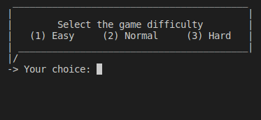
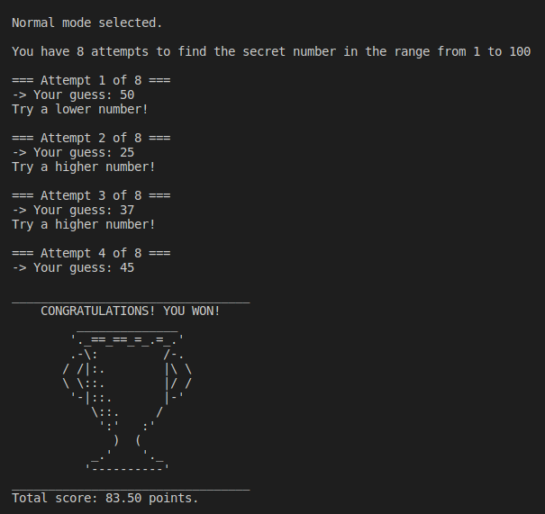

# Number Guessing Game

Game project developed in C Language. In this game you need to guess the number in the range from 1 to 100 before your attempts run out.

## Tools
- C
- GCC Compiler
- Makefile (to compile multiple files)

## How to use
With the GCC Compiler installed, open the repository on your Code Editor and type in the terminal:

###
Windows
```
mingw32-make
game.e
```

Linux
```
make
./game.e
```

MacOS
```
make
./game.e
```

## The Game Running



## License
[MIT License](https://choosealicense.com/licenses/mit/)
